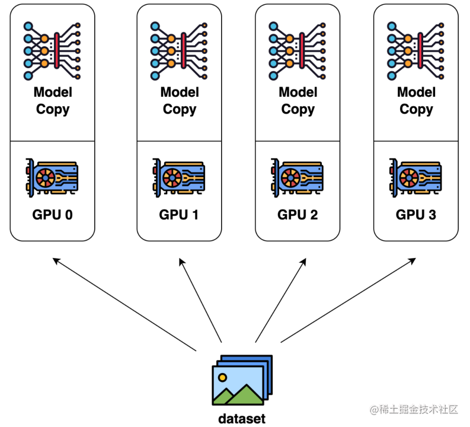
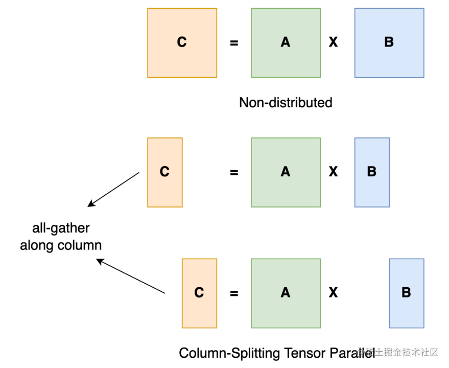
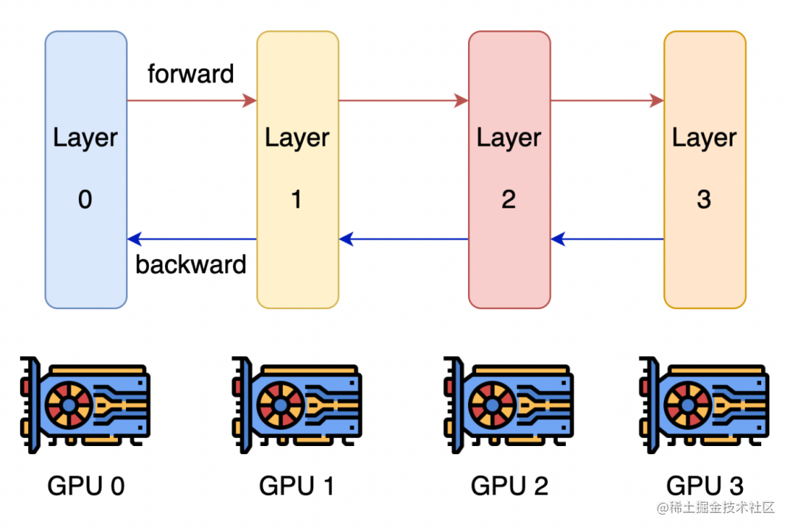
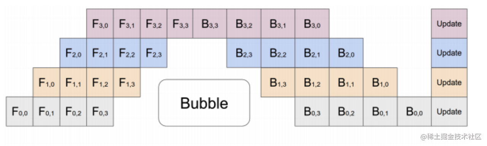
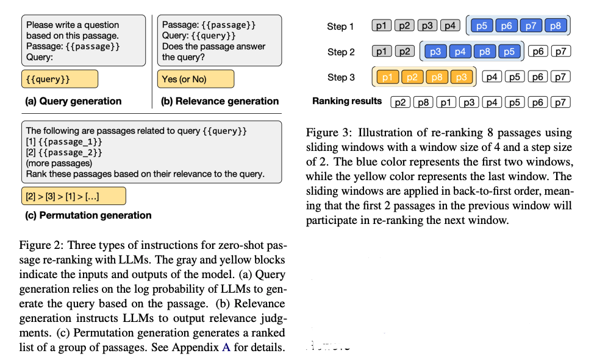
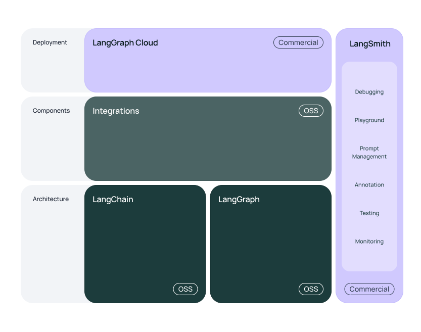

# QA-1-transformer框架

## Q-1 总体架构
[alt text](readme _image/image.png)
Transformer模型主要由两个部分组成：编码器（Encoder）和解码器（Decoder）。

 - 编码器（Encoder）：将输入序列编码成一组上下文向量。
 - 解码器（Decoder）：根据编码器生成的上下文向量和解码器自身的输入，生成输出序列。
 - 编码器和解码器分别由多个相同的层（Layer）堆叠而成，通常是6层（可以根据需要调整）。

## Q-2 编码器的输入
### 输入：
#### 1. **输入序列（Input Sequence）**：
   - 一个长度为 $n$ 的词序列 $X = [x _1, x _2, ..., x _n]$，每个$x _i$表示输入序列中的一个词或词片段。


#### 2. **词嵌入（Word Embeddings）**：
   - 输入序列中的每个词$x _i$被转换为一个词嵌入向量 $e _i$，词嵌入矩阵 $E$将所有词映射到一个连续的向量空间中。
   ##### 作用：
词嵌入（Word Embeddings）是将离散的单词表示为连续向量的技术，主要用于将输入序列中的每个词转换为高维向量。词嵌入的主要作用如下：

1. **捕捉词语之间的语义关系**：
   - 词嵌入将语义相似的词映射到相近的向量空间，例如，“king”与“queen”的词嵌入向量距离会比“king”和“dog”的距离更近。通过这种方式，模型可以更好地捕捉词语之间的语义关系。

2. **降维与稠密表示**：
   - 相比于 one-hot 编码方式，词嵌入将词语表示为稠密向量，大大减少了维度（通常是几十到几百维），从而降低了计算复杂度和内存消耗。

3. **增强模型的泛化能力**：
   - 通过预训练的词嵌入（如Word2Vec、GloVe、FastText等），模型可以利用大规模语料库中学到的知识，从而在小数据集上也能表现良好。

##### 举例：
假设输入序列为 "The quick brown fox"，其词嵌入表示为：

```plaintext
"The"  -> [0.1, 0.3, -0.2, ...]
"quick" -> [0.4, -0.1, 0.2, ...]
"brown" -> [0.5, 0.2, 0.3, ...]
"fox"   -> [-0.3, 0.4, 0.1, ...]
```
#### 3. **位置编码（Positional Encoding）**：
   - 由于Transformer没有内置的顺序信息，因此需要显式添加位置编码。位置编码向量 $p _i$与词嵌入向量 $e _i$相加，形成具有位置信息的输入向量：
 $
     h _i^0 = e _i + p _i
    $
   
   整个输入序列被表示为矩阵形式：
 $
     H^0 = [h _1^0, h _2^0, ..., h _n^0] 
    $

##### 作用：
位置编码（Positional Encoding）用于在Transformer模型中显式地引入序列的顺序信息。因为Transformer架构中没有循环神经网络（RNN）或卷积神经网络（CNN）那样的内置位置感知机制，所以需要通过位置编码来提供位置信息。位置编码的主要作用如下：

1. **引入序列位置信息**：
   - 位置编码为每个词嵌入增加唯一的位置信息，使模型能够区分同一词汇在不同位置上的含义。例如，在句子 "He is a good boy" 和 "A good boy is he" 中，“good boy”的位置不同，但词嵌入是相同的。位置编码可以帮助模型识别这种位置信息。

2. **增强模型的表达能力**：
   - 通过将词嵌入与位置编码相加，模型可以同时学习词语的语义信息和位置信息，从而提升模型的表达能力和性能。

3. **保持并行计算的优势**：
   - 位置编码以简单的加法方式引入，不影响模型的并行计算能力。相比于循环神经网络（RNN）逐步处理输入序列，Transformer的并行计算效率更高。

##### 形式：
常用的正弦和余弦函数作为位置编码：

$PE _{(pos, 2i)} = \sin\left(\frac{pos}{10000^{2i/d _{\text{model}}}}\right)$
$PE _{(pos, 2i+1)} = \cos\left(\frac{pos}{10000^{2i/d _{\text{model}}}}\right)$

其中：
-$pos$是词在序列中的位置。
- $i$是位置编码向量的维度。

### 输出：
- **编码器输出（Encoder Output）**：
  - 编码器输出一个序列的上下文表示 $H^{L} = [h _1^{L}, h _2^{L}, ..., h _n^{L}]$，其中 $L$是编码器层的数量（通常为6）。每个 $h _i^{L}$是包含输入序列上下文信息的向量。
## Q-3: 编码器的框架
每个编码器层包含两个主要子层：

1. **多头自注意力机制（Multi-Head Self-Attention Mechanism）**：
   - 输入序列中的每个词与其他所有词进行交互，生成加权和的表示。
   - 多头机制允许模型从不同的子空间中学习注意力分布。

2. **前馈神经网络（Feed-Forward Neural Network）**：
   - 将自注意力子层的输出进行非线性变换。通常由两层全连接网络组成。

每个子层之后都有一个**残差连接（Residual Connection）**和**层归一化（Layer Normalization）**。

编码器层的结构如下：

```plaintext
                输入向量
                    |
             自注意力机制
                    |
            残差连接和归一化
                    |
             前馈神经网络
                    |
            残差连接和归一化
                    |
                输出向量
```

## Q-4: 解码器的输入输出 
### 输入：
1. **解码器输入序列（Decoder Input Sequence）**：
   - 解码器的输入序列 $Y = [y _1, y _2, ..., y _m]$，每个 $y _i$表示解码器输入序列中的一个词或词片段。通常解码器会在每一步生成一个词，并将其作为下一步的输入。

2. **词嵌入（Word Embeddings）**：
   - 解码器输入序列中的每个词 $y _i$被转换为词嵌入向量 $e _i'$。

3. **位置编码（Positional Encoding）**：
   - 同样地，解码器输入序列中的每个词嵌入向量 $e _i'$与对应的位置信息 $p _i'$相加：
 $
     h _i'^0 = e _i' + p _i'
    $
   
   解码器的输入序列矩阵为：
 $
     H'^0 = [h _1'^0, h _2'^0, ..., h _m'^0]
    $

4. **编码器输出（Encoder Output）**：
   - 来自编码器的上下文表示 $H^{L}$也作为解码器的输入之一。

### 输出：
- **解码器输出（Decoder Output）**：
  - 解码器输出一个序列的预测表示 $H'^{L} = [h _1'^{L}, h _2'^{L}, ..., h _m'^{L}]$，其中 $L$是解码器层的数量（通常为6）。每个 $h _i'^{L}$是解码器生成的表示，结合了编码器输出的上下文信息。


## Q-5: 解码器
每个解码器层包含三个主要子层：

1. **带遮掩的多头自注意力机制（Masked Multi-Head Self-Attention Mechanism）：**
   - 仅关注解码器输入序列中当前词之前的词，防止未来信息泄露。

2. **多头注意力机制（Multi-Head Attention Mechanism）：**
   - 将解码器的当前状态与编码器的输出进行交互，获取上下文信息。

3. **前馈神经网络（Feed-Forward Neural Network）：**
   - 同编码器层。

每个子层之后都有一个**残差连接（Residual Connection）**和**层归一化（Layer Normalization）**。

编码器层的结构如下：

```plaintext
                输入向量
                    |
            遮掩自注意力机制
                    |
            残差连接和归一化
                    |
            多头注意力机制
                    |
            残差连接和归一化
                    |
             前馈神经网络
                    |
            残差连接和归一化
                    |
                输出向量

```

## Q-6: 多头自注意力机制
多头自注意力机制是Transformer的核心创新之一。它将输入向量分别投影到多个子空间，每个子空间计算独立的注意力分数，然后将结果拼接并线性变换。公式如下：

$\text{Attention}(Q, K, V) = \text{softmax}\left(\frac{QK^T}{\sqrt{d _k}}\right)V$

前置条件：输入向量为$H$,其形状为[n,d<sub>model</sub>],其中n是序列长度，d<sub>model</sub>是输入向量的维度

其中：
- $Q$是查询矩阵（Query）, 其中$Q _i=HW _i^Q$
- $K$是键矩阵（Key）, 其中$K _i=HW _i^K$
- $V$是值矩阵（Value）, 其中$V _i=HW _i^V$
- $d _k$是键向量的维度

对于多头注意力机制，计算会在多个子空间并行进行：

$\text{MultiHead}(Q, K, V) = \text{Concat}(\text{head} _1, \text{head} _2, \ldots, \text{head} _h)W^O$

每个头的计算方式为：

$\text{head} _i = \text{Attention}(HW _i^Q, HW _i^K, HW _i^V)$

## Q-7: Transformer的整体输入输出
### 输入：
- **源语言输入序列（Source Language Input Sequence）**：
  - 编码器的输入，即待翻译的文本序列 $X$。
- **目标语言输入序列（Target Language Input Sequence）**：
  - 解码器的输入，即已经生成的目标序列 $Y$（训练过程中是参考翻译，推理过程中是逐步生成的译文）。

### 输出：
- **生成的目标序列（Generated Target Sequence）**：
  - 最终由解码器生成的目标语言文本序列 $Y' = [y _1', y _2', ..., y _m']$，通常通过软最大化（Softmax）函数计算每个时间步上的词概率分布，并选择概率最高的词作为输出。

## Q-8： 示例
假设我们要使用Transformer翻译一个简单的句子 "The quick brown fox jumps over the lazy dog."（源语言）到 "Le renard brun rapide saute par-dessus le chien paresseux."（目标语言）。

### 编码器输入：

- 输入序列：`["The", "quick", "brown", "fox", "jumps", "over", "the", "lazy", "dog"]`
- 词嵌入向量：`[e _1, e _2, ..., e _9]`
- 位置编码向量：`[p _1, p _2, ..., p _9]`
- 输入向量：`[h _1^0, h _2^0, ..., h _9^0]`（词嵌入与位置编码相加）

### 编码器输出：
- 上下文表示：`[h _1^L, h _2^L, ..., h _9^L]`

### 解码器输入：

- 目标序列：`["Le", "renard", "brun", "rapide", "saute", "par-dessus", "le", "chien", "paresseux"]`（训练时使用参考翻译）
- 词嵌入向量：`[e _1', e _2', ..., e _9']`
- 位置编码向量：`[p _1', p _2', ..., p _9']`
- 输入向量：`[h _1'^0, h _2'^0, ..., h _9'^0]`
- 编码器输出：`[h _1^L, h _2^L, ..., h _9^L]`

### 解码器输出：
- 生成的目标序列表示：`[h _1'^L, h _2'^L, ..., h _9'^L]`
- 最终生成的译文：`["Le", "renard", "brun", "rapide", "saute", "par-dessus", "le", "chien", "paresseux"]`

## Q-9：transformer的训练：
- 用于有监督的学习任务，特别是在自然语言处理领域，如机器翻译、文本摘要和问答系统等
### 激活函数：
Transformer模型中使用的激活函数是 ReLU（Rectified Linear Unit）函数，在某些变体中也可能使用 GELU（Gaussian Error Linear Unit）函数。例如，在前馈神经网络（Feed-Forward Neural Network, FFNN）部分，激活函数用于增加非线性：

$$ \text{FFNN}(x) = \max(0, xW _1 + b _1)W _2 + b _2 $$

其中:

- $x$是输入变量
- $W _1$和$W _2$是权重矩阵
- $b _1$和$b _2$是偏置项。

### 损失函数：
损失函数用于评估模型的预测与真实标签之间的差异。在机器翻译等序列生成任务中，通常使用 交叉熵损失（Cross-Entropy Loss）：
$$ \text{Loss} = -\sum _{i=1}^{N} y _i \log(p _i) $$
其中：

- $N$是序列中的词数
- $y _i$是真实标签的独热编码
- $p _i$是模型预测的概率分布
- 损失函数中的$p _i$是与模型参数有关的变量，而$y _i$是与模型参数无关的固定标签。通过调整模型参数，使得$p _i$尽可能接近$y _i $，从而最小化损失函数。


#### 独热编码的生成

独热编码是将分类标签转换为向量的过程。在自然语言处理任务中，每个词都可以被映射到一个唯一的索引，然后转换为一个独热向量。例如，如果词汇表中有10000个词，词 “dog” 的索引是123，那么 “dog” 的独热编码就是一个10000维的向量，其中第123位为1，其余位为0。

### 参数更新
参数更新是通过 反向传播（Backpropagation）和 优化算法（如Adam或SGD）来实现的。Transformer模型特别使用了 学习率调度，其中学习率会随着训练进度进行调整。一个常见的学习率调度策略是 Noam学习率调度，它根据以下公式动态调整学习率：
$$ \text{lr} = d _{\text{model}}^{-0.5} \cdot \min(\text{step\_num}^{-0.5}, \text{step\_num} \cdot \text{warmup\_steps}^{-1.5}) $$

#### 反向传播

反向传播是通过损失函数的梯度来更新模型参数的过程。具体步骤如下：

- 前向传播：通过网络计算输出和损失。
- 计算梯度：计算损失函数相对于每个参数的梯度。
- 更新参数：根据梯度和学习率更新参数。

#### 参数更新基本思想
参数更新是通过优化算法（如Adam或SGD）来实现的。以梯度下降（Gradient Descent）为例，参数更新公式如下：
$$ \theta \leftarrow \theta - \eta \frac{\partial \text{Loss}}{\partial \theta} $$

其中：

- $θ$是模型参数
- $\eta$ 是学习率
- $\frac{\partial \text{Loss}}{\partial \theta}$ 是损失函数相对于参数的梯度。

#### Adam优化算法更新参数
在Transformer中，通常使用Adam优化算法来更新参数，其参数更新公式如下： 

$$ m _t = \beta _1 m _{t-1} + (1 - \beta _1) \nabla _\theta L(\theta _{t-1}) $$
$$ v _t = \beta _2 v _{t-1} + (1 - \beta _2) (\nabla _\theta L(\theta _{t-1}))^2 $$
$$ \hat{m} _t = \frac{m _t}{1 - \beta _1^t} $$
$$ \hat{v} _t = \frac{v _t}{1 - \beta _2^t} $$
$$ \theta _t = \theta _{t-1} - \eta \frac{\hat{m} _t}{\sqrt{\hat{v} _t} + \epsilon} $$

其中：

- $m _t$和$v _t$ 分别是动量项和加速度项的指数加权平均
- $\beta _1$和$\beta _2$是动量项和加速度项的衰减率
- $\eta$ 是学习率。
- $\epsilon$ 是一个小常数，防止除零错误。
- $\nabla _\theta L(\theta _{t-1}) $是损失函数相对于参数的梯度
- $t$为时间步
# QA-2-transformer深度细节

# QA-2.5-transformer衍生的框架
## prefix-decoder
Prefix Decoder (自回归模型)通常用于生成任务，如语言模型和自动文本生成。它的特点是：

 - 自回归生成：推理时在生成下一个词时，依赖于已经生成的前缀（即之前生成的词）。
 - 输入形式：在推理的每一步，模型接收前面已经生成的词作为输入，并预测下一个词。
 - 示例：GPT系列模型就是典型的Prefix Decoder。

在训练过程中，Prefix Decoder 通常使用教师强制（teacher forcing），即在每一步使用真实的前缀而不是模型生成的前缀。
## Causal Decoder
Causal Decoder 也是用于自回归生成任务，其特点是：

 - 自回归生成：和 Prefix Decoder 一样，Causal Decoder 也是自回归的，依赖于已经生成的前缀。
 - 因果关系：在训练和生成过程中，当前词只能看到之前的词，不能看到未来的词。即它遵循严格的因果关系。
 - 遮掩机制：使用遮掩机制（masking）确保当前词只能访问到之前的词。例如，在Transformer模型中，未来的词被屏蔽，确保模型只依赖于已经生成的词。
# QA-3-百模预训练框架

# QA-4-经典模型预训练框架-代码细节

# QA-5-模型框架内部多种方法细节-自QA-4衍生

# QA-5.5-大语言模型分布式训练框架总结
## 原语通信技术
## 并行计算技术
### 数据并行（data parallel DP）
- 数据并行操作是最常见也最简单是操作，在数据并行操作中，数据集被分割成n个碎片，n个设备都有完整的模型副本，并在对应的数据碎片中进行训练，在反向传播计算完梯度后，模型的梯度会进行all reduce（全归纳，聚合求平均）使得每个设备的梯度都一致，同步更新参数。典型的数据并行实现：PyTorch DDP。

- 明显的缺点就是每张卡加载完整模型副本以及小批量的数据也可能爆显存，所以可以用混精度训练、继续减少每批次的数据大小、多次前向和反向累积梯度或者**模型分割(模型并行)**


### 模型并行-**张量并行**：
通常模型并行的一类：张量并行（层内并行）

将一个张量沿特定维度分成 N 块，每个设备只持有整个张量的 1/N。同时不影响计算图的正确性。这需要额外的通信来确保结果的正确性。

也就是说一个1x2的A与2x2的B相乘可以拆成，1x2的A与两个2x1相乘后拼起来。

典型的张量并行实现：Megatron-LM（1D）、Colossal-AI（2D、2.5D、3D）。
### 模型并行-**流水并行**
流水线并行的核心思想是，模型按层分割成若干块，每块都交给一个设备。
- 在前向传播过程中，每个设备将中间的激活传递给下一个阶段。
- 在后向传播过程中，每个设备将输入张量的梯度传回给前一个流水线阶段。

这允许设备同时进行计算，从而增加训练的吞吐量


流水线并行训练的一个明显缺点是训练设备容易出现空闲状态（因为后一个阶段需要等待前一个阶段执行完毕），导致计算资源的浪费，加速效率没有数据并行高


### 混合并行
# QA-6-微调方法-框架-细节

# QA-7-微调代码细节

# QA-8-RAG各环节技术
## RAG pipeline的整个流程
- 请求转换、路由和请求构造、索引和检索、生成和评估。[来源](https://www.cnblogs.com/charlieroro/p/18087301)
## 为什么要用RAG
1. **新数据**:
   - llms并不了解你的数据，且无法获取与此相关的最新数据，它们是事先使用来自互联网的公共信息训练好的，因此并不是专有数据库的专家也不会针对该数据库进行更新
2. **上下文窗口**
   - 每个llm都有一个tokens的最大限制，用于限制用户每次提交的tokens数据，这会导致丢失上下文窗口之外的上下文，进而影响准确性、产生检索问题和幻觉等
3. **中间遗失**
   - 即使llms可以一次性接收所有数据，但它存在根据信息在文档中的位置来检索信息的问题。[研究表明](https://arxiv.org/abs/2307.03172)如果相关信息位于文档中间(而非开头或结尾)时就会导致严重的性能降级(感知减弱)。

## 请求转换
1. **重写-检索-读取**
   - 这种方式注重对用户的查询进行重构，使用一个llm生成一个查询，然后用检索器来检索内容，llm再回答[rewriter-retriver-reader](https://arxiv.org/abs/2305.14283)。此外这个方法是可训练的，以llm性能为奖励强化学习生成查询的llm。
2. **对问题进行浓缩或者改写**
   - 通常用于会话中，通过把对话改写成一个好的独立问题来给聊天机器人提供上下文
3. **RAG-fusion**
   - 将RAG和倒数排名融合([RRF](https://arxiv.org/abs/2402.03367))结合。生成多个查询(从多个角度添加上下文)，并使用倒数分数($\frac{1}{\text{rank} + k}$)对查询结果重新排序，然后将文档和分数进行融合，从而得到更全面和准确的回答
4. **Step-Back Prompting**
   - 这是一种更加技术性的提示技术，设计stepback-question后通过LLM的抽象来衍生出更高层次的概念和首要原则.根据此概念和首要原则结合问题进行推理。[论文](https://arxiv.org/abs/2310.06117)和[博客](https://blog.csdn.net/m0_49651195/article/details/140265857)
5. **Query Expansion**
   - 对查询进行扩展：通过为LLM提供一个查询并生成新的内容来扩展查询的过程
   - **使用生成的答案进行扩展**：LLM基于查询生成一个答案，然后将答案追加到查询中并执行嵌入搜索。通过使用假设的答案来扩展查询，可以检索到相关向量空间的信息。
   - **多个查询扩展**： LLM基于查询生成多个额外的类似查询，然后将这些额外的查询和原始查询一同进行向量库检索，可以提高准确性。值得注意的是需要迭代提示才能找出最佳生成查询的效果。

## 路由
环境中可能出现多个数据库或者向量存储，答案可能位于其中任何一个，因此需要对查询进行路由。
1. **逻辑路由**
   - 让LLM根据预定义的路径来决定参考知识库的哪些部分。通过LLM来选择知识库。根据知识库的概述来判断应该选择哪个知识库
2. **语义路由**
   - 不同类型问题对应不同的嵌入提示，如化学领域、物理领域的嵌入提示。计算嵌入查询和嵌入提示的相似度，选择最高相似度的嵌入提示，随后应用到llm中(可直接响应，也可根据提示对应的知识库检索后再响应)

## 请求构造
数据存储有结构性(SQL)的和非结构性(vectorstore)的以及半结构半非结构(graph db),不同结构性对应不同的请求
1. **自查询检索器-Self-query-retriever**
   - 向量数据库中带有清晰元数据文件的非结构化数据可以启用此类retriever，任何问题都能被拆分成一个查询和过滤数据(metadata)，再经过llm整理格式，随后进行向量库检索。
2. **少样本实例**
   - 为llm提高少量的QA示例，如果示例较多则可以进行向量存储后动态检索出部分示例。
3. **fine-tuning**
   - 相比较于将整个schema添加在llm提示中，直接通过微调可以有效提高准确性。

## 索引
索引大致指的是被查询的数据如何规划构建，chunk划分和嵌入是实现准确检索的索引核心部分。简单来说，将用户请求转化成一个嵌入向量(embedding)并通过语义相似性检索信息，向量之间相似计算可以是
- 余弦相似度
$$\text{cosine similarity} = \frac{\vec{A} \cdot \vec{B}}{||\vec{A}|| \cdot ||\vec{B}||}$$
- 向量内积
$$\vec{A} \cdot \vec{B} = \sum_{i=1}^{n} A _i \times B _i$$
- 欧式距离
$$\text{Euclidean distance} = \sqrt{\sum_{i=1}^{n} (A_i - B_i)^2}$$

### Chunk优化
考虑数据本身以及运用场景

1. **基于规则**(使用分隔符切分)
   - **固定长度**：固定数目字符划分Chunk，缓解上下遗失的方式为添加重叠部分
   - **NLTK语句分词器(sentence tokenizer)**:将给定的文本切分成语句。受限于对底层文本的语义理解
   - **spacy语句分割器**：另一种基于语句进行拆分，也于NLTK存在同样问题
   - **递归结构感知分割**：试图平衡固定的块大小和语言边界，提供精确的上下文控制。难度高
   - **结构感知拆分**：根据句子、段落、部分或章节进行划分
   - **内容感知拆分**：侧重于内容类型和结构，确保内容类型不会在块中混合

### 多表示索引
将文本转换为压缩的检索单元
1. **父文档**
   - 若干的小chunk作为叶子节点，其父节点均为其叶子的摘要，叶子节点小chunk的元数据保存其所属的父节点(大chunk)，父节点存储在inmemorystore中，叶子节点嵌入到vectorstore中，从vectorstor中检索出若干个叶子节点(小chunk)，再从inmemorystore中索引出父节点(大chunk)，将小chunk和大chunk一同传递给LLM。

### 密集检索(dense X retrievel)
[论文](https://arxiv.org/pdf/2312.06648)中定义proposition为最小分块。每个proposition需要满足三个条件：
- 1 文本中不同含义，所有proposition组合可表示整个文章 
- 2 最小单元：不可再分proposition
- 3 上下分相关和包含：每个proposition应包含所需的上下文

相关[代码](https://github.com/chentong0/factoid-wiki):通过微调模型进行proposition提取。举例：
```markdown
title = "Leaning Tower of Pisa"
section = ""
content = "Prior to restoration work performed between 1990 and 2001, Leaning Tower of Pisa leaned at an angle of 5.5 degrees, but the tower now leans at about 3.99 degrees. This means the top of the tower is displaced horizontally 3.9 meters (12 ft 10 in) from the center."

input_text = f"Title: {title}. Section: {section}. Content: {content}"

output = [
  "Prior to restoration work performed between 1990 and 2001, Leaning Tower of Pisa leaned at an angle of 5.5 degrees.",
  "Leaning Tower of Pisa now leans at about 3.99 degrees.",
  "The top of Leaning Tower of Pisa is displaced horizontally 3.9 meters (12 ft 10 in) from the center."
]
```

### 特定嵌入
领域特定/高级嵌入模型
- fine-tuning对嵌入模型进行微调可以帮助改进检索能力。对于固定领域的文档有效。可提升5-10%
- [ColBERT](https://github.com/stanford-futuredata/ColBERT):一个端到端且快速准确的检索模型，在数十毫秒内对大型文本集合进行基于 BERT 的可扩展搜索。它会将每个段落编码为token级嵌入的矩阵(如下蓝色所示)。当执行一个搜索时，它会将用户查询编码为另一个token级嵌入的矩阵(如下绿色所示)。然后基于上下文匹使用"可扩展的向量相似性(MaxSim)操作"来匹配查询段落。

### 分层索引
1. **RAPTOR模型**：
   - 对文本块的聚类进行摘要来实现更准确的检索，llamaindex提供了这种[实现](https://github.com/run-llama/llama_index/blob/main/llama-index-packs/llama-index-packs-raptor/examples/raptor.ipynb)

## 检索
### Ranking
1. **提升多样性**：
这里有必要提一下Haystack的DiversityRanker：
   - 首先计算每个文档的嵌入向量，然后使用一个sentence-transformer模型进行查询搜索
   - 将语义上和查询最接近的文档作为第一个选择的文档
   - 对于剩下的每个文档，会计算和所选择文档的平均相似性
   - 然后选择和所选择文档最不相似的文档
   - 然后重复上述步骤，直到选出所有文档，这样就得到了一个整体多样性从高到低排序的文档列表。

2. **[LostInTheMiddleReranker](https://arxiv.org/abs/2307.03172)**
   - 通过重排序来让最佳的文档位于上下文窗口的开头和结尾。建议在相关性和多样性之后再使用该Reranker

3. **[CohereRerank](https://cohere.com/blog/rerank)**
    - rerank端点充当搜索的最后阶段，搜索出的结果列表输入到rerank端点中，该端点由rerank大语言模型支持，该模型计算查询与每个初始搜索结果的相关性的分数，从而rerank
    ```
    results = co.rerank(query=query, documents=documents, top_n=3, model="rerank-multilingual-v2.0")
    ```

4. **[bge-rerank](https://www.llamaindex.ai/blog/boosting-rag-picking-the-best-embedding-reranker-models-42d079022e83)**
   - reranker模型与嵌入模型需要自行探索。[bge-reranker-base](https://huggingface.co/BAAI/bge-reranker-base)：通常可以提高嵌入的命中率和 MRR。

5. **RankGPT**
   - 为了解决检索上下文大于LLM的上下文窗口的问题，该方法使用了一种"滑动窗口"策略，即在滑动窗口内实现渐进排名。这种方式击败大部分rerank，注意的是延迟和成本。
   - 比如：有8个段落但llm上下文只能支持6个段落，无法全部输入让llm进行rerank，因此采用滑动窗口为4，step为2，进行3轮rerank，需要注意的是滑动窗口是从后向前滑动，每一轮rerank后对新的排序段落进行rerank。
   

6. **[RAG-fusion](https://towardsdatascience.com/forget-rag-the-future-is-rag-fusion-1147298d8ad1)**
   - 这是 Adrian Raudaschl提出的一种方法,使用Reciprocal Rank Fusion (RRF)和生成查询来提高检索质量。该方法会使用一个LLM根据输入生成多个用户查询，并为每个查询运行一个向量搜索，最后根据RRF聚合并优化结果。在最后一步中，LLM会使用查询和重排序列表来生成最终输出。这种方法在响应查询时具有更好的深度，因此非常流行.[demo code](https://github.com/langchain-ai/langchain/blob/master/cookbook/rag_fusion.ipynb)
   RRF公式：
   $$\operatorname{RRFscore}(d \in D)=\sum_{r \in R} \frac{1}{k+r(d)}$$
   - D表示文档总量，d表示某个文档
   - R表示R个不同排名的列表，每个列表有n个文档，对应多个查询，每个查询生成一个多文档的列表。
   - k为偏置项常量，常见k为1，避免分母接近0
   - RRF由于是非学习的rerank，因此可适用大部分项目且效果较好，但对于部分项目，也许使用学习的rerank-model效果会好些。

### 提示压缩(Prompt Compression)
1. **[LongLLMLingua](https://arxiv.org/abs/2310.06839)**
   - 该方式基于[Selective-Context](https://arxiv.org/abs/2310.06201) 和 [LLMLingua](https://arxiv.org/abs/2310.05736) 框架，是用于提示压缩的SOTA方法，针对成本和延迟进行了优化
   - 除此之外，LongLLMLingua采用了一种"采用问题感知由粗到细的压缩方法、文档重新排序机制(针对中间信息衰弱)、动态压缩比例（根据重要性分数）、压缩后的子序列恢复（也许部分信息会被压缩错误，因此用原序列进行恢复）等策略来提升大型语言模型对关键信息的感知能力"的方式来提升检索质量。该[方法](https://llmlingua.com/?utm_source=div.beehiiv.com&utm_medium=referral&utm_campaign=advanced-rag-series-retrieval)特别适用于长上下文文档，解决"中间遗失"问题。[code](https://github.com/microsoft/LLMLingua),同时也集成到了langchian和llamaindex，见方法

2. **[LLMLingua-2](https://arxiv.org/abs/2403.12968)**
   - 提升

3. **[RECOMP](https://arxiv.org/abs/2310.04408)**
   - 使用"压缩器"，该方法使用文本摘要作为LLMs的上下文来降低成本并提升推理质量。两个压缩器分别表示： a)提取压缩器，用于从检索的文档中选择相关语句；b)抽象压缩器，用于根据多个文档的合成信息来创建摘要。

4. **[Walking Down the Memory Maze](https://arxiv.org/abs/2310.05029)**
   - 该方法引入了MEMWALKER的概念，即按照树的格式来处理上下文。该方法会对上下文划分chunk，然后对每个部分进行概括。为了回答一个查询，该模型会沿着树结构来迭代提示，以此来找出包含问题答案的段。特别适用于较长序列。


5. **CRAG**
   - 它使用一个轻量的检索评估器以及外部数据源(如web搜索)来补充最终的生成步骤。
   - 检索评估器(model)会对检索的文档和输入进行评估，并给出一个置信度，会产生3个动作：correct、ambiguous、incorect，如果correct则进行knowledge refinement，如果ambiguous则同时进行knowledge refinement和knowledge searching in web，如果incorrect则直接进行knowledge searching in web

6. **[FLARE](https://arxiv.org/abs/2305.06983)**
   - 该方法特别适用于长文本生成，它会生成一个临时的"下一个语句"，并根据该语句是否包含低概率tokens来决定是否执行检索。该方法可以很好地决定什么时候进行检索，可以降低幻觉以及非事实的输出
   - 对于输入x，生成一个回答，并判断回答中是否存在低概率token，每个步骤都会根据上一步骤的查询以及这一步骤的回答生成这一步骤的查询，如果需要检索则用这一步骤的查询进行检索并添加到输入中，以帮助未来的生成，以此类推

## 生成和评估
### 生成
1. **Corrective RAG (CRAG)**
   - 结合检索方法中提到的，该方法会将检索出的内容分配置信度，分为3个类，正确、模糊、不正确，因此可以用来增加生成。

2. **[Self-RAG](https://arxiv.org/abs/2310.11511)**
   - 将任一LLM训练为可以对自己生成的结果进行自我反省的模型
   - 然后LLM会通过并行处理这些检索到的段落来并发生成结果。该步骤会触发LLM生成用于评估这些结果的critique tokens。
   - 最后根据"真实性"和"相关性"来选择用于最终generation的最佳结果。
   - 下面Langchain的[示意图](https://blog.langchain.dev/agentic-rag-with-langgraph)展示了基于上述定义的reflection token的Self-RAG 推理决策算法。
   

3. **[RRR (Rewrite-Retrieve-Read)](https://arxiv.org/pdf/2305.14283.pdf)**
   - 该框架假设用户查询可以被LLM进一步优化(及重写)，从而实现更精确的检索。虽然这种方式可以通过LLMs的查询重写过程来提升表现，但也存在推理错误或无效查询之类的问题，因此可能不适用于部署在生产环境中。

### 评估
RAG pipeline中实现评估的方式有很多种，如使用一组Q&A作为测试数据集，并将输出与实际答案进行对比验证。但这种方式的缺点是不仅需要花费大量时间，并且增加了针对数据集本身优化pipeline的风险(而非可能存在很多边缘场景的现实世界)。
1. **[RAGas](https://github.com/explodinggradients/ragas)**

- RAGAs(RAG Assessment的简称)是一个用于评估RAG pipeline的开源框架，它可以通过如下方式评估pipeline：
   - 提供基于"[ground truth](https://domino.ai/data-science-dictionary/ground-truth)"(真实数据)来生成测试数据的方式
   - 为检索和generation阶段以独立或端到端的方式提供基于指标的评估

- 它使用如下RAG特征作为指标：

   - 真实性：事实一致性
   - 回答相关性：问题和查询的相关性
   - 上下文准确性：校验相关chunks的排名是否更高
   - 批判(Critique)：根据预定义的特征(例如无害和正确性)评估提交
   - 上下文回顾：通过比较ground truth和上下文来校验是否检索到所有相关信息
   - 上下文实体回顾：评估上下文检索到的和ground truth中的实体数目
   - 上下文相关性：检索到的上下文和提示的相关性
   - 回答语义相似性：生成的答案和实际的语义相似性
   - 回答正确性：评估生成答案与实际答案的准确性和一致性
- 上面提供了一组可以全面评估RAG的列表，推荐阅读[Ragas](https://docs.ragas.io/en/stable)文档。

2. **[Langsmith](https://www.langchain.com/langsmith)**
   - LangSmith 是一个可以帮助调试、测试、评估和监控基于任何LLM空间构建的chains和agents平台。
   - 通过将Langsmith和RAG进行结合可以帮助我们更深入地了解结果。通过Langsmith评估logging和tracing部分可以更好地了解到对哪个阶段进行优化可以提升retriever或generator。

3. **[DeepEval](https://github.com/confident-ai/deepeval)**
   - 另一种值得提及的评估框架称为DeepEval。它提供了14种以上涵盖RAG和微调的指标，包括G-Eval、RAGAS、Summarization、Hallucination、Bias、Toxicity 等。

   - 这些指标的自解释信很好地说明了指标评分的能力，使之更易于调试。这是跟上面的RAGAs的关键区别。

   - 此外，它还有一些不错的特性，如集成Pytest (开发者友好)，其模块化组件等也是开源的。

   - Evaluate → Iterate → Optimize

   - 通过生成和评估阶段，我们不仅可以部署一个RAG系统，还可以评估、迭代并针对我们设计的特定场景进行优化

# QA-9-RAG产品系统
- **数据工程**: 知识库的形式丰富多彩,这其中配合RAG我们要做的事情非常多，包括文件类型、格式、分割策略、知识类型、索引方式等等
- **检索生成**:当我们处理完成数据后，配合大模型需要进行检索生成，而在这个过程中，包括：Prompt工程、检索方式、向量库中间件、大模型、检索结果压缩、重排等内容
- **业务系统**: 这是配合商业行为所衍生的业务系统&上层产品应用，包括租户、计费、开放平台、洞察、运营等业务系统

# QA-10-langchain、langsmith、langgraph

1. langgraph
   - 面向multi-agent应用，以node和edge为主体结构，可处理复杂任务，但封装的node仅支持api-llm，但每个node和edge也可以自己设计，就是会更加底层更加麻烦，很适合构建私人复杂的任务，如果能够兼容本地llm的话。
2. langsmith
   - 是一个评估代码的平台，可以看代码运行的流
# QA-9-agent
