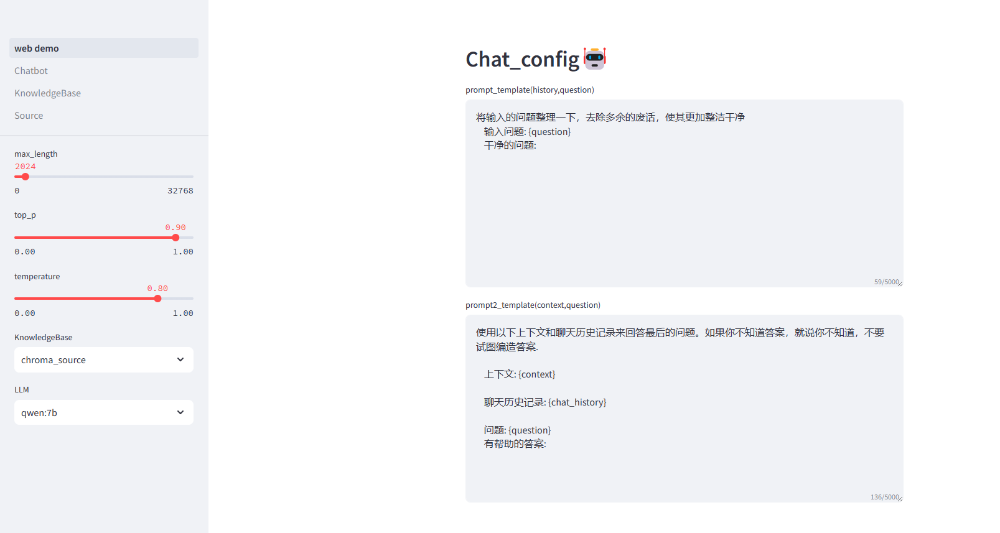
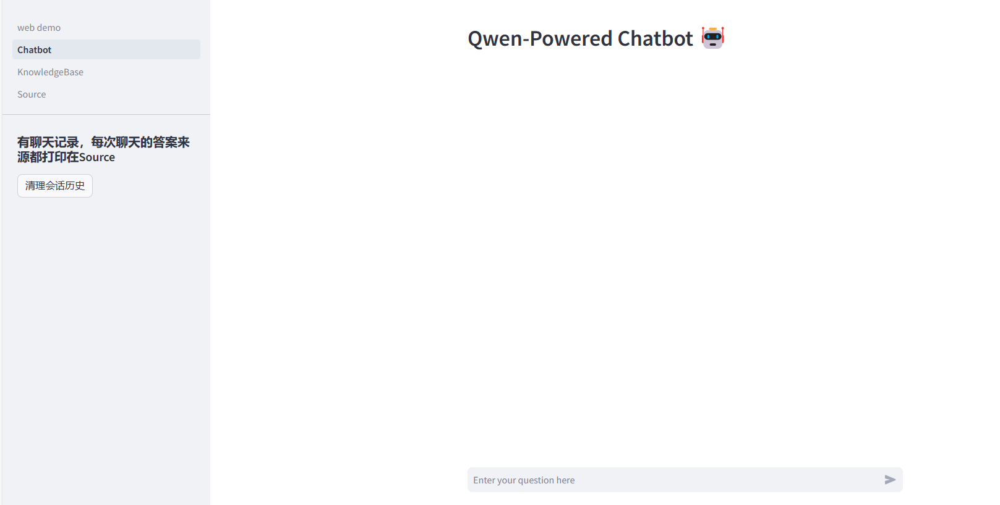
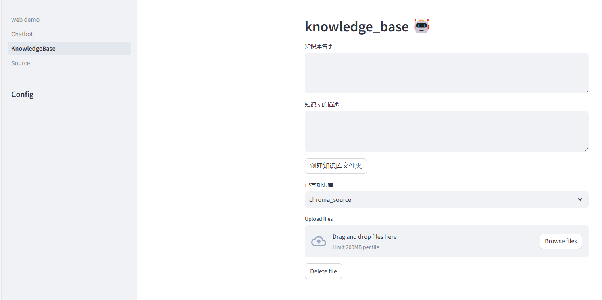

# 环境配置
```bash
pip install requirements.txt -r
```

# 配置语言模型
```bash
curl -fsSL https://ollama.com/install.sh | sh
ollama pull qwen:7b
```

# 快速开始
```bash
streamlit run web_demo.py
```

# 页面展示

主页面web demo用来配置语言模型的参数以及选择知识库


可创建或继续添加知识进入知识库中
